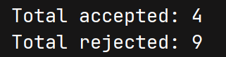

# 进度

## 一、工作进展

### 1. 相关文献

#### Active Task-Inference-Guided Deep Inverse Reinforcement Learning

> 主动任务推理引导的深度逆强化学习

- **来源**: [CDC 2020](https://doi.org/10.1109/CDC42340.2020.9304190)
- **作者**: Farzan Memarian, Zhe Xu, Bo Wu, Min Wen, Ufuk Topcu

该论文将复杂交互行为序列建模为结构化状态转移模型，并通过行为模式自动机对专家行为进行刻画与分析。论文结果表明，使用自动机对专家行为模式进行形式化建模能够有效描述行为结构并支持后续行为匹配与分析工作。这篇文章在思路与方法上与我的想法大致相同，为我们的研究提供了**可行性参考**，但实际效果**仍需通过实验验证**。

---

### 2. 自动机模型构建与实验验证
本周完成了模糊匹配自动机的构建，并基于该自动机对专家课堂课例序列进行了匹配实验。

<figure style="text-align: center;">
  
  <figcaption style="font-weight: bold;">Fig.1 构建的模糊匹配自动机</figcaption>
</figure>

主要工作包括：

- 构建基于教学行为标签序列的自动机结构；
- 设计模糊匹配机制以增强自动机的容错能力；
- 将专家课堂行为序列映射到自动机结构中，并统计匹配情况。

---

## 二、实验中发现的问题

### 1. 专家课例与优质序列匹配频率较低

实验结果表明：

- 部分专家教学序列无法完全落入自动机定义的优质路径中；
- 即使采用模糊匹配策略，仍存在较多路径偏离现象。

<figure style="text-align: center;">
  
  <figcaption style="font-weight: bold;">Fig.2 取一条专家课例序列进行匹配实验</figcaption>
</figure>

---

### 2. 初步问题分析

经过我的观察，当前低匹配率可能来源于以下因素：

1. **专家教学行为的多样性**：专家在实际教学中可能采用多种策略，导致行为序列呈现多模态特征，难以被单一自动机结构完全覆盖。
2. **自动机表达能力有限**：当前自动机模型可能过于简化，未能充分捕捉教学行为的复杂性和变异性。
3. **模糊匹配机制的局限性**：现有的模糊匹配策略可能无法有效处理某些类型的偏离，导致部分合理变体未被识别。
4. **数据噪声与标注误差**：专家行为数据中可能存在噪声或标注不准确的情况，影响了匹配效果。
---

## 三、一些其余问题

### 1. 构建自动机不存在通用方法，需要人工设计
目前自动机的构建主要依靠人工对优质序列的理解与分析，缺乏系统化的构建流程和工具支持，导致自动机设计过程较为**繁琐**且易受**主观因素影响**。

## 四、后续工作计划

后续工作我打算从以下几个方面展开：
1. **根据自动机搭建逆强化学习环境**：利用自动机结构设计奖励机制，指导策略学习以优化教学行为序列的生成。
2. **优化改进自动机结构**：引入更复杂的状态和转移机制，以提升自动机对教学行为多样性的表达能力。
3. **在专家课例和优质序列中寻找一个平衡点**：通过分析专家课例中的共性，调整优质路径定义，使其更具包容性。
